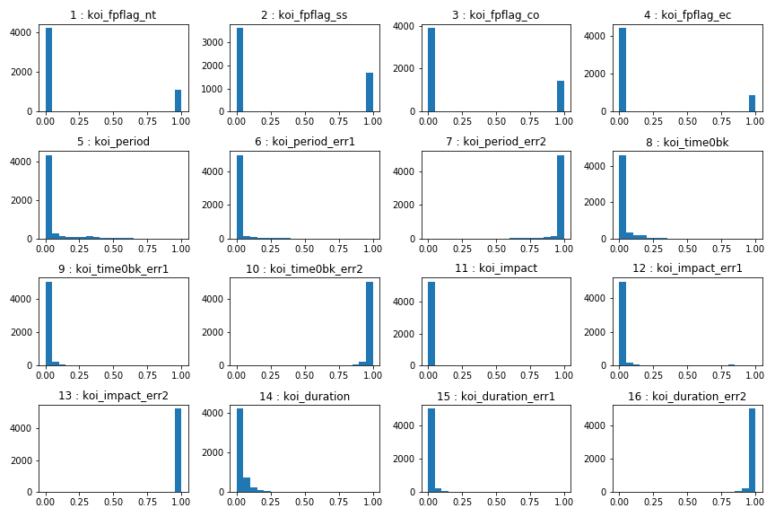
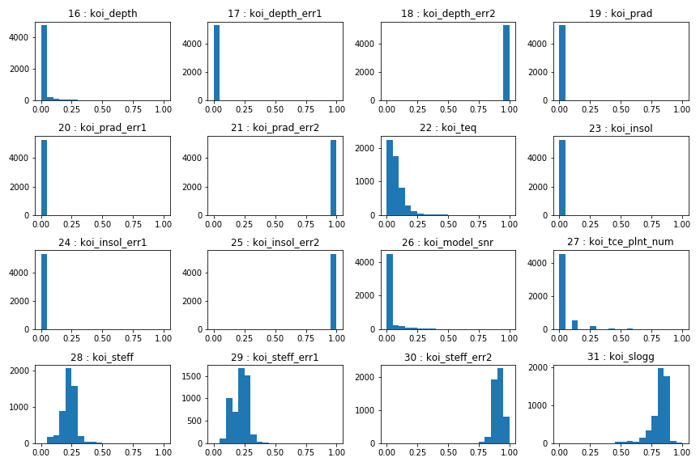
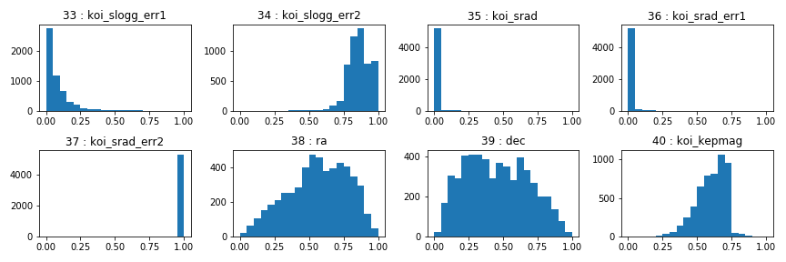

# Machine Learning - Exoplanet Exploration

## Background

Over a period of nine years in deep space, the NASA Kepler space telescope has been out on a planet-hunting mission to discover hidden planets outside of our solar system. The project goal is to develop machine learning models capable of classifying candidate exoplanets from the raw dataset.

The field: koi_disposition (depenendent variable) contains the assigned disposition of each observation in the raw data. The assigned disposition has the following options: 
 * "CONFIRMED": object confirmed to be exoplanets.
 * "CANDIDATE": have not yet been formally classified.
 * "FALSE POSITIVE" objects determined not to be exoplanets.
For training purposes, all rows from the raw data assigned "CANDIDATE" have been dropped. 

## Final Model

### Preprocess the Data

The mean and standard devation was calculated for each independent field by koi_disposition ("CONFIRMED", "FALSE POSITIVE"). A histrogram for each independent variables was generated. Based on the review of the mean, the standard devation, and the histograms the following variables koi_period_err2, koi_time0bk_err2, koi_duration_err2, koi_depth_err2 were removed. See Jupyter Notebook (https://github.com/chrisholt0222/machine-learning-challenge/tree/master/models_outcomes2).

#### Fields 1 - 16:

#### Fields 17 - 32:

#### Fields 33 - 40:

The following was applied to the data before use in each model:
* NAs were removed.
* Drop all rows were koi_disposition = "CANDIDATE".
* Drop the fields: koi_period_err2, koi_time0bk_err2, koi_duration_err2, koi_depth_err2.
* The data was separated into training and testing data using the `train_test_split` function.
* The `MinMaxScaler` function is used to scale the numerical independent data.
* The `LabelEncoder` and `to_categorical` were used to cattegorize the dependend variable.

### Feature Selection - RFE

The RFE function (recursive feature elimination) was used with the LogisticRegression model to eliminate unnecesasry features (independent variables). Features ranked below 1 where removed from future models. 

Field removed:
* koi_period_err1, koi_time0bk, koi_impact, koi_impact_err1, koi_impact_err2, koi_duration,
* koi_depth_err1, koi_prad, koi_prad_err1, koi_prad_err2, koi_insol, koi_insol_err1, 
* koi_insol_err2, koi_srad, koi_srad_err1, koi_srad_err2, dec, koi_kepmag

### Tune Model Parameters

* The `GridSearch` fundtion was applied to the following models: `SVC` (support vector machine) and `Sequential` (neural network) to tune model parameters for each model.

### Results

The inital model was a binary classifier using logistic regression without scaling the independent data. The model yielded predictive accuracy of approximately 0.661 on the testing data. Using MinMaxScaler to scale the independent varialbes, the result of the logistice regression model inmproved to 0.990. After removing the unneccessary features, the model test results are unchanged, 0.990.

The next two model are applied to the fully transformed and reduced data. 

Usnig a Support Vector Machine (SVM), the reasults are similar at 0.9902. Tuning the hyperparameters C and Gamma using `GridsearchCV`, the best model is C = 1.0 , and Gamma = 0.0001, with a predictive accuracy of 0.9904.

A `Sequential` model achieved a predictive accuracy score of 0.9904 on the test data. This model used the `adam` optimizer, the `categorical crossentropy` loss function and two hidden layers with 40 and 20 nodes. The `GridsearchCV` selected the parameters: batch_size = 20, epochs = 100, and optimizer = RMSprop.
