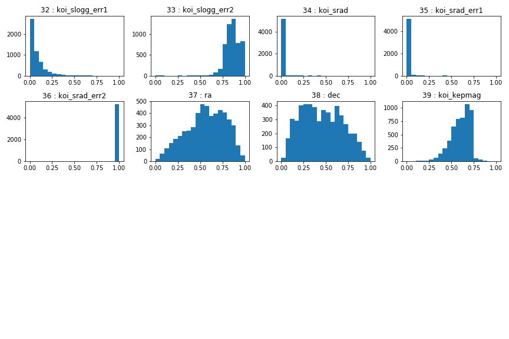

# Machine Learning - Exoplanet Exploration

## Background

Over a period of nine years in deep space, the NASA Kepler space telescope has been out on a planet-hunting mission to discover hidden planets outside of our solar system. The project goal is to develop machine learning models capable of classifying candidate exoplanets from the raw dataset.

The field: koi_disposition (depenendent variable) contains the assigned disposition of each observation in the raw data. The assigned disposition has the following options: 
 * "CONFIRMED": object confirmed to be exoplanets.
 * "CANDIDATE": have not yet been formally classified.
 * "FALSE POSITIVE" objects determined not to be exoplanets.
For training purposes, all rows from the raw data assigned "CANDIDATE" have been dropped. 

### Preprocess the Data

In file The mean and standard devation was calculated for each independent field by koi_disposition ("CONFIRMED", "FALSE POSITIVE"). A histrogram for each independent variables was generated.

Fields 1 - 16:

Fields 17 - 32:

Fields 33 - 40:

The following fields were dropped: koi_period_err2, koi_time0bk_err2, koi_duration_err2, koi_depth_err2.

The following was applied to the data before use in each model:
* NAs were removed.
* Drop all rows where koi_disposition = "CANDIDATE".
* Drop the fields: koi_period_err2, koi_time0bk_err2, koi_duration_err2, koi_depth_err2.
* Use `MinMaxScaler` to scale the numerical data.
* Separate the data into training and testing data.

Perform feature selection and remove unnecessary features.

### Tune Model Parameters

* Use `GridSearch` to tune model parameters.
* Tune and compare at least two different classifiers.

### Reporting

* Create a README that reports a comparison of each model's performance as well as a summary about your findings and any assumptions you can make based on your model (is your model good enough to predict new exoplanets? Why or why not? What would make your model be better at predicting new exoplanets?)

